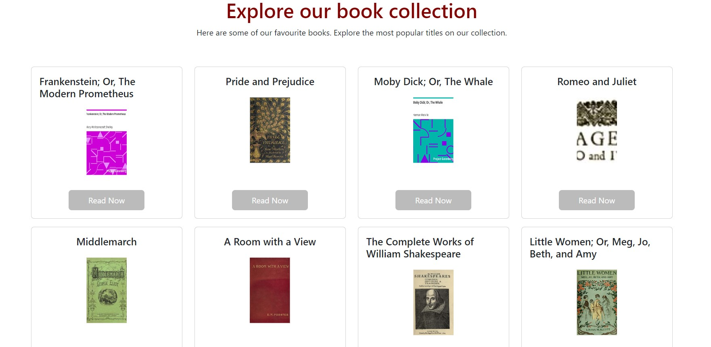

# BookGnosis

This is a free library platform, where users can read free copyright books.

## Description

In this app, users can access a vast collection of free copyright books and articles that can be read online for free! Whether you're an avid reader, a student, or simply someone who loves to explore new ideas, BookGnosis is a virtual library where users can widen their knowledge with the click of a button.

## Instalation

The app can be accessed here [Netlify](https://profound-pie-e13055.netlify.app/)

## Usage

1. Browse: Explore our collection by browsing through categories or using the search bar.
2. Select: Click on the book or article you're interested in reading.
3. Read: Start reading directly from your browser.

## Credits

[Paul Asquith](https://github.com/Paul-codecourse)

[Fernanda Lujan](https://github.com/MaFer74)

[Frank Gabriel Rodríguez Lee](https://github.com/frankrl86)

[Jessica Santos](https://github.com/jess-santos)

[Alexandra Ionescu](https://github.com/ionescuea)

## Contributing

Contributions are welcome! If you'd like to contribute to this project, follow these steps:

1. Fork the repository.
2. Create a new branch for your feature: `git checkout -b feature-name`
3. Make your changes and commit them: `git commit -m 'Add new feature'`
4. Push to the branch: `git push origin feature-name`
5. Create a pull request to merge your changes into the main branch.

## License

Licensed under the [MIT](LICENSE) license.
